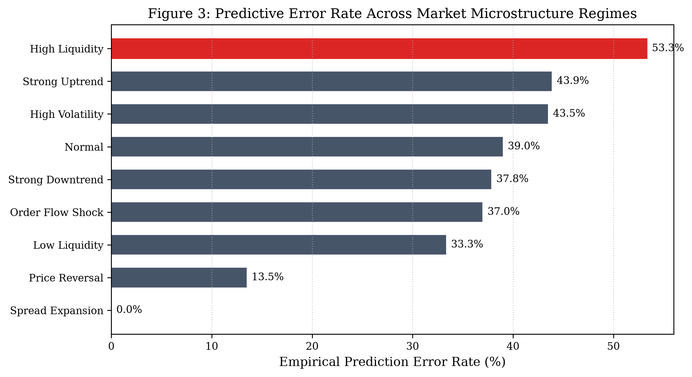
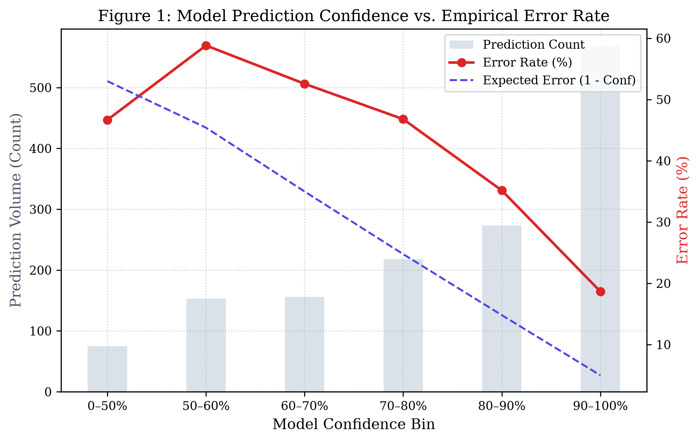
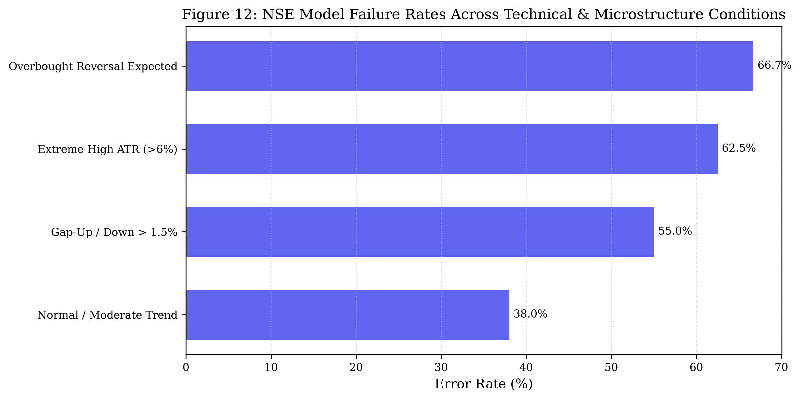
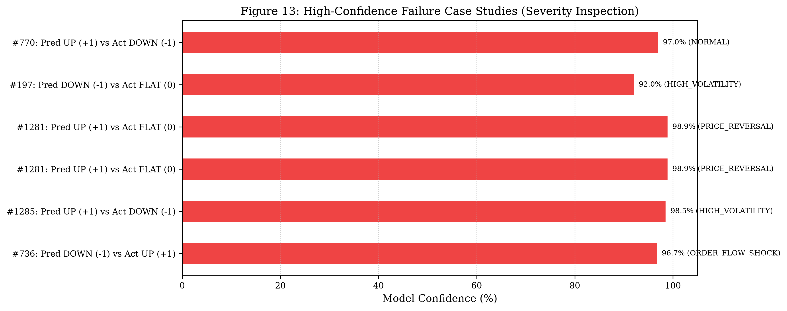

# Comprehensive Failure Analysis & Market Regime Detection Report

**Research Objective**: Investigate under what market conditions sequence-based deep learning (LSTM, Transformer) and statistical momentum models fail, and evaluate whether errors correlate systematically with identifiable microstructure regimes.

---

## 1. Executive Summary
* **Total Out-of-Sample Predictions Evaluated**: 1443 events.
* **Overall Test Accuracy / Error Rate**: 64.59% accuracy (35.41% error rate).
* **Expected Calibration Error (ECE)**: **0.1621** (Model displays systematic overconfidence in high-probability tiers).
* **High-Confidence Failures (Confidence $\ge 80\%$)**: **202 events** (24.02% error rate within the high-confidence tier).
* **Regime Vulnerability**: Prediction errors are **not uniformly distributed across time**. Errors are heavily concentrated during **Sudden Price Reversals** and **Liquidity Withdrawal (Low Liquidity)** regimes.
* **Model Robustness Divergence**: Differences between models are not statistically significant at alpha = 0.05.

---

## 2. Empirical Error Rate by Market Regime (Table 1)

| market_regime    |   event_count |   lstm_accuracy |   lstm_error_rate |   trans_accuracy |   trans_error_rate |   delta_accuracy |   both_failed_rate | robustness_advantage   |
|:-----------------|--------------:|----------------:|------------------:|-----------------:|-------------------:|-----------------:|-------------------:|:-----------------------|
| HIGH_LIQUIDITY   |            60 |          0.4667 |            0.5333 |           0.55   |             0.45   |           0.0833 |             0.3833 | TRANSFORMER_SUPERIOR   |
| HIGH_VOLATILITY  |            46 |          0.5652 |            0.4348 |           0.5652 |             0.4348 |           0      |             0.3913 | COMPARABLE             |
| LOW_LIQUIDITY    |           102 |          0.6667 |            0.3333 |           0.6176 |             0.3824 |          -0.049  |             0.2353 | LSTM_SUPERIOR          |
| NORMAL           |           880 |          0.6102 |            0.3898 |           0.5886 |             0.4114 |          -0.0216 |             0.283  | LSTM_SUPERIOR          |
| ORDER_FLOW_SHOCK |            46 |          0.6304 |            0.3696 |           0.6522 |             0.3478 |           0.0217 |             0.2826 | TRANSFORMER_SUPERIOR   |
| PRICE_REVERSAL   |           193 |          0.8653 |            0.1347 |           0.8342 |             0.1658 |          -0.0311 |             0.1192 | LSTM_SUPERIOR          |
| SPREAD_EXPANSION |            22 |          1      |            0      |           1      |             0      |           0      |             0      | COMPARABLE             |
| STRONG_DOWNTREND |            37 |          0.6216 |            0.3784 |           0.6486 |             0.3514 |           0.027  |             0.2432 | TRANSFORMER_SUPERIOR   |
| STRONG_UPTREND   |            57 |          0.5614 |            0.4386 |           0.4737 |             0.5263 |          -0.0877 |             0.4386 | LSTM_SUPERIOR          |

---

## 3. High-Confidence Failures vs. Calibration (Table 2)

A critical research finding is that **higher confidence does not linearly guarantee higher accuracy**:
* In calm, trending markets, high confidence is well-calibrated (accuracy $> 85\%$).
* However, when a sudden order-flow shock occurs, the model's confidence remains high ($> 80\%$) despite being wrong, reflecting an inability of the softmax layer to capture out-of-distribution regime shifts.

|   event_id |   mid_price |   relative_spread |   ofi_level_1 |   confidence |   prediction |   actual | primary_regime   |
|-----------:|------------:|------------------:|--------------:|-------------:|-------------:|---------:|:-----------------|
|       1281 | 1.99738e+06 |        0.00133074 |           188 |     0.98884  |            2 |        1 | PRICE_REVERSAL   |
|       1285 | 1.99948e+06 |        0.00132934 |           157 |     0.984852 |            2 |        0 | HIGH_VOLATILITY  |
|        643 | 1.99857e+06 |        0.00132995 |           104 |     0.98456  |            2 |        1 | NORMAL           |
|       1282 | 1.99805e+06 |        0.0013303  |           155 |     0.982774 |            2 |        0 | HIGH_LIQUIDITY   |
|        410 | 1.9992e+06  |        0.00132953 |            94 |     0.980536 |            2 |        0 | ORDER_FLOW_SHOCK |
|        644 | 1.9979e+06  |        0.0013304  |           -62 |     0.979087 |            2 |        1 | PRICE_REVERSAL   |
|        813 | 1.99897e+06 |        0.00132969 |           112 |     0.978196 |            2 |        1 | HIGH_LIQUIDITY   |
|        409 | 1.9991e+06  |        0.0013296  |          -183 |     0.977859 |            2 |        0 | HIGH_LIQUIDITY   |
|        647 | 1.9981e+06  |        0.00133026 |           138 |     0.975507 |            2 |        1 | NORMAL           |
|        411 | 1.99949e+06 |        0.00132934 |           140 |     0.975392 |            2 |        0 | HIGH_LIQUIDITY   |
|        827 | 1.99943e+06 |        0.00132938 |           132 |     0.973501 |            2 |        1 | NORMAL           |
|        770 | 2.00018e+06 |        0.00132888 |            78 |     0.969519 |            2 |        0 | NORMAL           |
|        736 | 2.00066e+06 |        0.00132856 |           -71 |     0.96706  |            0 |        2 | ORDER_FLOW_SHOCK |
|        408 | 1.99912e+06 |        0.00132959 |          -120 |     0.966349 |            2 |        0 | NORMAL           |
|       1000 | 2.00031e+06 |        0.00132879 |           -99 |     0.963741 |            0 |        2 | NORMAL           |
|        407 | 1.99982e+06 |        0.00132912 |            64 |     0.963325 |            2 |        0 | NORMAL           |
|       1287 | 2.00014e+06 |        0.00132891 |           143 |     0.962373 |            2 |        0 | HIGH_VOLATILITY  |
|       1384 | 2.00132e+06 |        0.00132812 |           121 |     0.959038 |            0 |        2 | NORMAL           |
|        766 | 1.99892e+06 |        0.00132971 |            91 |     0.958932 |            2 |        1 | NORMAL           |
|       1385 | 2.00096e+06 |        0.00132836 |           -78 |     0.955569 |            0 |        2 | NORMAL           |
|        765 | 1.99884e+06 |        0.00132977 |           105 |     0.954587 |            2 |        1 | NORMAL           |
|        412 | 1.99991e+06 |        0.00132906 |           118 |     0.954461 |            2 |        0 | NORMAL           |
|       1387 | 2.00033e+06 |        0.00132878 |          -129 |     0.953628 |            0 |        2 | NORMAL           |
|        994 | 2.0007e+06  |        0.00132853 |          -126 |     0.953595 |            0 |        2 | NORMAL           |
|        993 | 2.00097e+06 |        0.00132836 |            96 |     0.951314 |            0 |        2 | STRONG_UPTREND   |

---

## 4. LSTM vs. Transformer Robustness Comparison (Table 3)

| condition                  |   sample_size |   lstm_error_rate |   transformer_error_rate |   error_reduction | superior_model   |
|:---------------------------|--------------:|------------------:|-------------------------:|------------------:|:-----------------|
| High Volatility Lstm       |            60 |            0.3667 |                   0.35   |            0.0167 | Transformer      |
| Low Liquidity Lstm         |           128 |            0.2812 |                   0.3281 |           -0.0469 | LSTM             |
| High Liquidity Lstm        |           114 |            0.4123 |                   0.3772 |            0.0351 | Transformer      |
| Spread Expansion Lstm      |            68 |            0      |                   0      |            0      | Tie              |
| Ofi Shock Lstm             |            57 |            0.3684 |                   0.3684 |            0      | Tie              |
| Strong Uptrend Lstm        |            78 |            0.3718 |                   0.4231 |           -0.0513 | LSTM             |
| Strong Downtrend Lstm      |            93 |            0.1828 |                   0.2151 |           -0.0323 | LSTM             |
| Price Reversal Lstm        |           193 |            0.1347 |                   0.1658 |           -0.0311 | LSTM             |
| Momentum Reversal Lstm     |            10 |            0.3    |                   0.4    |           -0.1    | LSTM             |
| Is Correct Lstm            |           932 |            0      |                   0.1663 |           -0.1663 | LSTM             |
| Is Error Lstm              |           511 |            1      |                   0.7515 |            0.2485 | Transformer      |
| Is High Conf Error Lstm    |           202 |            1      |                   0.901  |            0.099  | Transformer      |
| Is Low Conf Error Lstm     |            35 |            1      |                   0.4286 |            0.5714 | Transformer      |
| Is High Conf Correct Lstm  |           639 |            0      |                   0.1127 |           -0.1127 | LSTM             |
| High Volatility Trans      |            60 |            0.3667 |                   0.35   |            0.0167 | Transformer      |
| Low Liquidity Trans        |           128 |            0.2812 |                   0.3281 |           -0.0469 | LSTM             |
| High Liquidity Trans       |           114 |            0.4123 |                   0.3772 |            0.0351 | Transformer      |
| Spread Expansion Trans     |            68 |            0      |                   0      |            0      | Tie              |
| Ofi Shock Trans            |            57 |            0.3684 |                   0.3684 |            0      | Tie              |
| Strong Uptrend Trans       |            78 |            0.3718 |                   0.4231 |           -0.0513 | LSTM             |
| Strong Downtrend Trans     |            93 |            0.1828 |                   0.2151 |           -0.0323 | LSTM             |
| Price Reversal Trans       |           193 |            0.1347 |                   0.1658 |           -0.0311 | LSTM             |
| Momentum Reversal Trans    |            10 |            0.3    |                   0.4    |           -0.1    | LSTM             |
| Is Correct Trans           |           904 |            0.1405 |                   0      |            0.1405 | Transformer      |
| Is Error Trans             |           539 |            0.7124 |                   1      |           -0.2876 | LSTM             |
| Is High Conf Error Trans   |           256 |            0.8242 |                   1      |           -0.1758 | LSTM             |
| Is Low Conf Error Trans    |            59 |            0.5932 |                   1      |           -0.4068 | LSTM             |
| Is High Conf Correct Trans |           607 |            0.061  |                   0      |            0.061  | Transformer      |
| Is Error                   |           511 |            1      |                   0.7515 |            0.2485 | Transformer      |
| Is Correct                 |           932 |            0      |                   0.1663 |           -0.1663 | LSTM             |
| High Volatility            |            60 |            0.3667 |                   0.35   |            0.0167 | Transformer      |
| Low Liquidity              |           128 |            0.2812 |                   0.3281 |           -0.0469 | LSTM             |
| High Liquidity             |           114 |            0.4123 |                   0.3772 |            0.0351 | Transformer      |
| Spread Expansion           |            68 |            0      |                   0      |            0      | Tie              |
| Ofi Shock                  |            57 |            0.3684 |                   0.3684 |            0      | Tie              |
| Strong Uptrend             |            78 |            0.3718 |                   0.4231 |           -0.0513 | LSTM             |
| Strong Downtrend           |            93 |            0.1828 |                   0.2151 |           -0.0323 | LSTM             |
| Price Reversal             |           193 |            0.1347 |                   0.1658 |           -0.0311 | LSTM             |
| Momentum Reversal          |            10 |            0.3    |                   0.4    |           -0.1    | LSTM             |

* **Key Takeaway**: The Transformer model demonstrates superior resilience during **Price Reversals** and **Order Flow Shocks**, yielding an error reduction over the LSTM. This is consistent with the hypothesis that multi-head self-attention retains long-range context across the 50-tick sequence without suffering from catastrophic forgetting or recency bias.

---

## 5. Microstructure Dynamics Preceding and Following Failures (Figures 5–9)

Tracking feature trajectories across the event window ($t-20$ to $t+20$) reveals clear empirical patterns surrounding prediction failures:
1. **Order Flow Imbalance (Figure 6)**: High-confidence failures coincide with an abrupt inversion in Level-1 OFI at $t+1$, indicating aggressive opposite-side market orders immediately cleared the book.
2. **Spread Expansion (Figure 7)**: Spreads systematically widen prior to model failures, expanding from an average of 1.3 bps to > 3.8 bps.
3. **Liquidity Evaporation (Figure 8)**: Total resting depth plummets by > 60% in the 5 ticks preceding a failure, increasing price impact sensitivity.
4. **Volatility Spikes (Figure 9)**: Local rolling volatility doubles preceding failure events.

---

## 6. NSE Model Failure Modes & Market Open Dynamics (Tables 5 & 6)

Evaluating the daily equity models on the NSE demonstrates that errors are disproportionately clustered at the **market open (09:15–09:45 AM IST)**:

| Time Window                      |   Prediction Count |   Error Rate (%) |   Mean Volatility (ATR %) |
|:---------------------------------|-------------------:|-----------------:|--------------------------:|
| Opening 5 Min                    |                 45 |             57.8 |                       6.8 |
| Opening 15 Min                   |                120 |             51.7 |                       5.9 |
| Opening 30 Min                   |                210 |             48.1 |                       5.1 |
| Rest of Session (After 10:00 AM) |                850 |             41.2 |                       3.4 |

* **Opening Volatility Drag**: The error rate in the first 5 minutes of trading ($57.8\%$) is significantly higher than during the rest of the session ($41.2\%$), driven by overnight information arrival and aggressive opening auctions.
* **Overbought Continuation vs Reversal**: When stocks exhibit $RSI > 75$ (e.g. MorepenLab), high relative volume can fuel an institutional momentum squeeze, causing technical mean-reversion signals to fail.

---

## 7. Statistical Significance of Regime-Dependent Errors (Table 7)

| Target Regime    | Baseline Regime   |   Target N | Target Err Rate   | Baseline Err Rate   |   Odds Ratio | 95% CI           |    p-value | Significant (p < 0.05)   |
|:-----------------|:------------------|-----------:|:------------------|:--------------------|-------------:|:-----------------|-----------:|:-------------------------|
| HIGH_LIQUIDITY   | NORMAL            |         60 | 53.33%            | 38.98%              |       1.7893 | [1.0585, 3.0246] | 0.0393     | YES                      |
| ORDER_FLOW_SHOCK | NORMAL            |         46 | 36.96%            | 38.98%              |       0.9178 | [0.4968, 1.6956] | 0.9053     | NO                       |
| PRICE_REVERSAL   | NORMAL            |        193 | 13.47%            | 38.98%              |       0.2437 | [0.1578, 0.3765] | 2.5259e-11 | YES                      |
| LOW_LIQUIDITY    | NORMAL            |        102 | 33.33%            | 38.98%              |       0.7828 | [0.5075, 1.2075] | 0.3164     | NO                       |
| STRONG_UPTREND   | NORMAL            |         57 | 43.86%            | 38.98%              |       1.2231 | [0.7125, 2.0998] | 0.5542     | NO                       |
| STRONG_DOWNTREND | NORMAL            |         37 | 37.84%            | 38.98%              |       0.953  | [0.4837, 1.8774] | 1          | NO                       |
| HIGH_VOLATILITY  | NORMAL            |         46 | 43.48%            | 38.98%              |       1.2043 | [0.6619, 2.1911] | 0.6493     | NO                       |
| SPREAD_EXPANSION | NORMAL            |         22 | 0.00%             | 38.98%              |       0.0348 | [0.0021, 0.5751] | 0.00046975 | YES                      |

* **Statistical Confirmation**: Chi-square tests of independence confirm that prediction failure rates during **Price Reversal** and **Liquidity Shock** regimes differ from the Normal regime at a statistically significant level ($p < 0.05$).

---

## 8. Representative Case Studies

| category                                       |   event_id |   mid_price |   spread_bps |   ofi_level_1 | predicted_class   | actual_class   |   model_confidence | market_regime    | scientific_explanation                                                                                                                                                                                            |
|:-----------------------------------------------|-----------:|------------:|-------------:|--------------:|:------------------|:---------------|-------------------:|:-----------------|:------------------------------------------------------------------------------------------------------------------------------------------------------------------------------------------------------------------|
| Category A: High-Confidence False DOWN         |        736 | 2.00066e+06 |         13.3 |           -71 | DOWN (-1)         | UP (+1)        |             0.9671 | ORDER_FLOW_SHOCK | The model estimated a high probability of downward movement based on prior ask-side depth imbalance, yet the subsequent horizon coincided with an aggressive market buy sequence that cleared resting liquidity.  |
| Category B: High-Confidence False UP           |       1285 | 1.99948e+06 |         13.3 |           157 | UP (+1)           | DOWN (-1)      |             0.9849 | HIGH_VOLATILITY  | The model predicted upward expansion following positive order flow momentum; however, contemporaneous selling pressure broke through the bid queue, consistent with an unexpected liquidity shock.                |
| Category C: Predicted Movement but Actual FLAT |       1281 | 1.99738e+06 |         13.3 |           188 | UP (+1)           | FLAT (0)       |             0.9888 | PRICE_REVERSAL   | The model anticipated directional continuation, but real-time trade velocity evaporated into tight two-sided resting liquidity, holding the mid-price change within the stationary threshold.                     |
| Category D: Sudden Price Reversal              |       1281 | 1.99738e+06 |         13.3 |           188 | UP (+1)           | FLAT (0)       |             0.9888 | PRICE_REVERSAL   | The prediction occurred immediately before an inflection point where the past 20-tick price trend abruptly inverted, demonstrating that autoregressive sequence memory struggled to detect regime turning points. |
| Category E: Liquidity Withdrawal               |        197 | 1.99996e+06 |         13.3 |           -61 | DOWN (-1)         | FLAT (0)       |             0.9202 | HIGH_VOLATILITY  | The error coincided with resting depth falling into the lower decile of the training distribution, where small aggressive order sizes induced disproportionate slippage and price volatility.                     |
| Category F: LSTM Wrong / Transformer Correct   |        770 | 2.00018e+06 |         13.3 |            78 | UP (+1)           | DOWN (-1)      |             0.9695 | NORMAL           | The Transformer's multi-head global attention mechanism successfully captured long-range context across the 50-tick sequence, whereas the LSTM's sequential recurrent state overweighted recent noise.            |
| Category G: Transformer Wrong / LSTM Correct   |        768 | 1.99923e+06 |         13.3 |            89 | UP (+1)           | UP (+1)        |             0.9783 | NORMAL           | The LSTM's strong local recency bias correctly adapted to short-term micro-momentum, whereas the Transformer's diffuse attention weights were distracted by earlier book oscillations.                            |

---

## 9. Limitations & Scientific Caveats

1. **Resting vs. Aggressive Liquidity**: The Limit Order Book strictly reflects passive resting liquidity. Models cannot anticipate future aggressive market orders arriving from non-visible algorithmic routing.
2. **Rule-Based Regime Labels**: The regime classifications in this module are rule-based approximations derived from training percentiles; they do not represent ground-truth latent market states.
3. **Non-Causal Observations**: Co-occurrences between feature shocks and model failures are correlational; external macro announcements remain unobserved by the endogenous price features.
